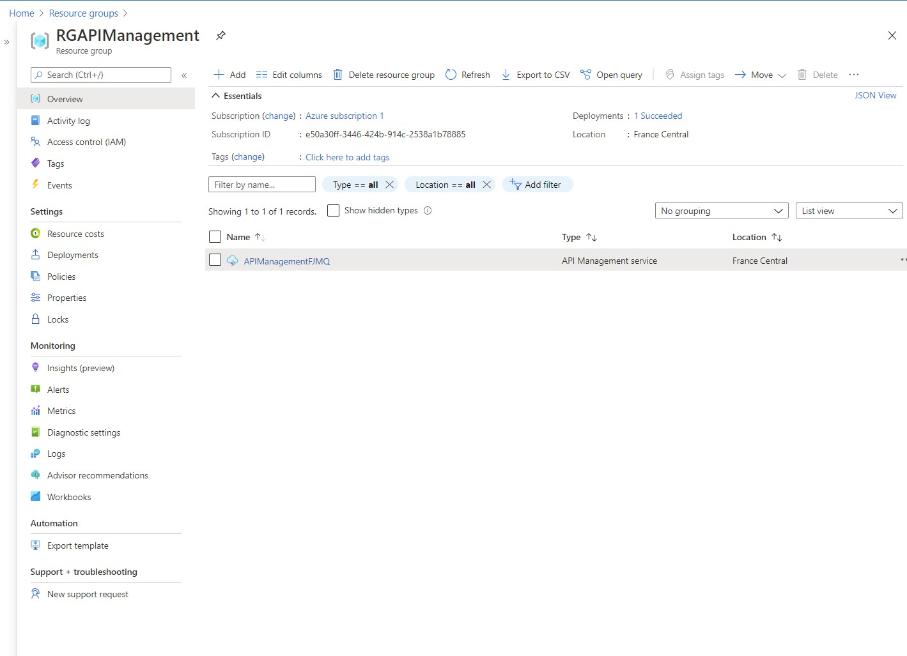
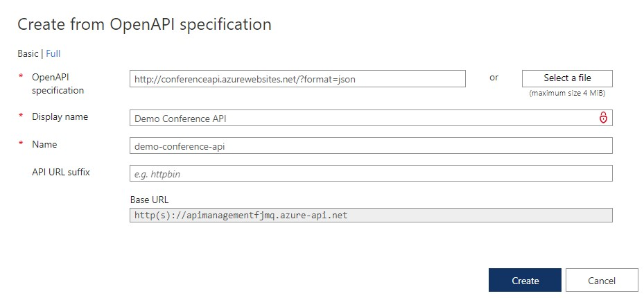
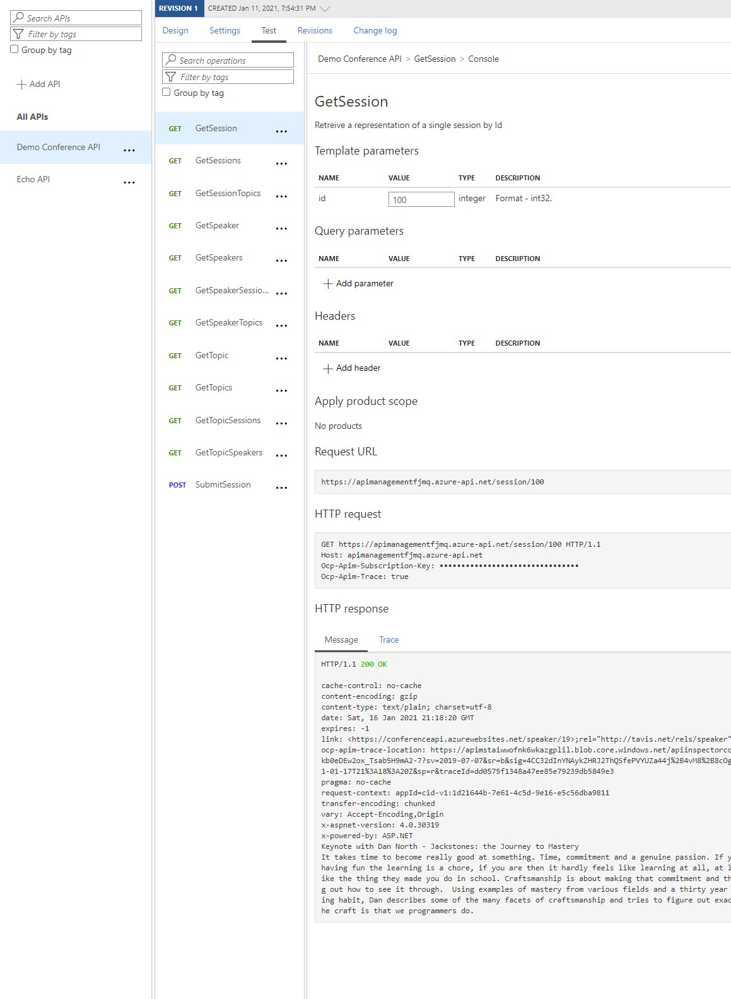

# Module 6: Deploying and Managing Services

# Lesson 5: Defining Service Interfaces with Azure API Management 

### Demonstration: Importing and Testing an OpenAPI Specification

- Creamos un API management

  

- Creamos un API desde OPENAPI

- Probamos

  

